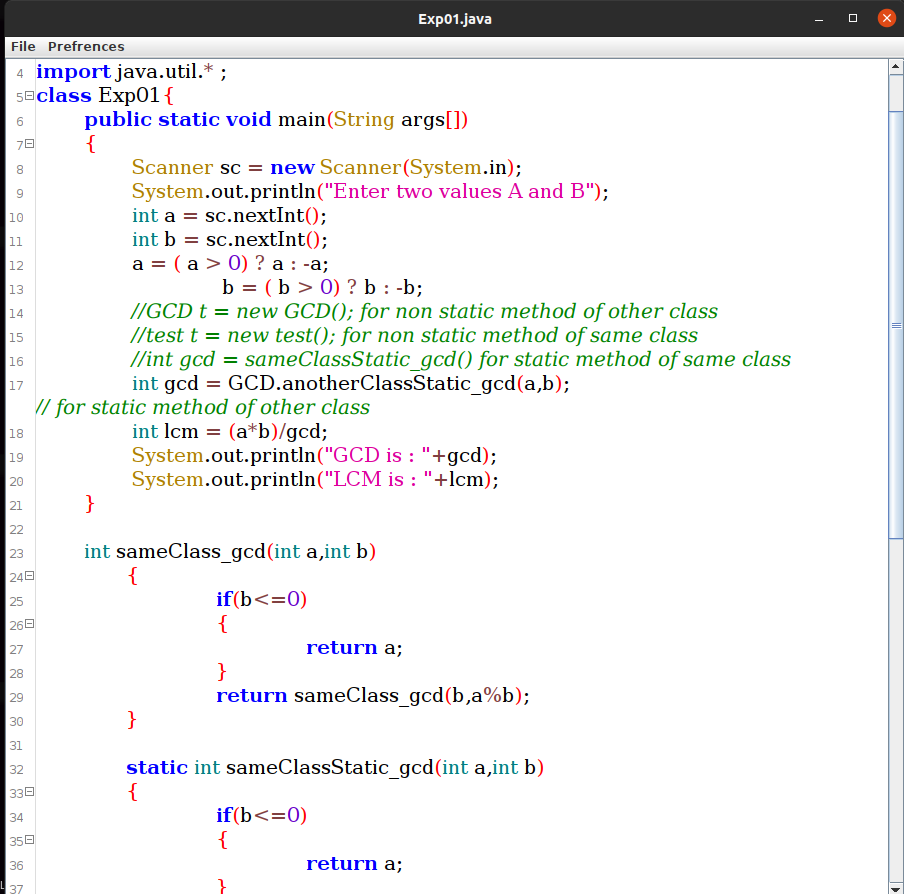
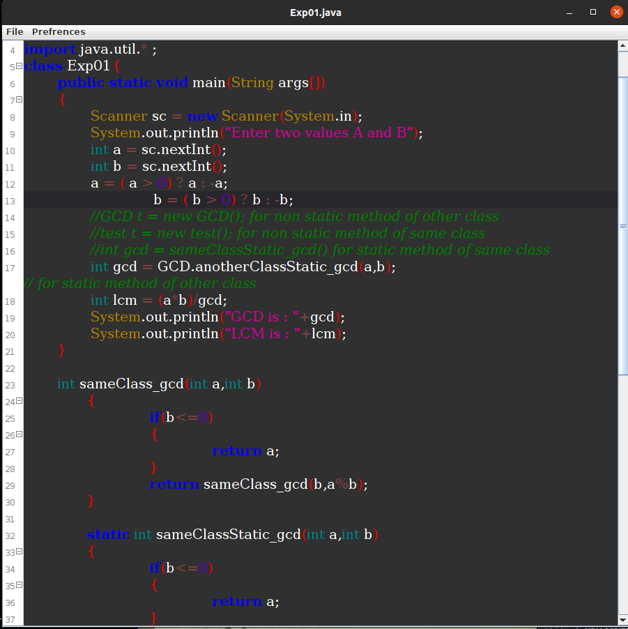

<h1 align="center">
  <br>
  Text Editor
  <br>
</h1>

<h4 align="center">A Text editor using JAVA.</h4>
<p align="center">
    
    <a href="https://hits.seeyoufarm.com"></a>
</p>

<p align="center">
  • <a href="#key-features">Key Features</a> •
  <a href="#how-to-use">How To Use</a>
</p>



## Key Features

- ### Syntax Highlighting
- ### Custom Themes
  - Dark, Light 
- ### Cross Platform
  - Windows, Linux ready.

## How To Use

To clone and run this application, you'll need [Git](https://git-scm.com) installed on your computer. From your command line:

```bash
# Below commands are tried and tested on Linux and Windows OS

# Clone this repository
$ git clone https://github.com/Team-Eureka04/Text-editor

# Go into the repository
$ cd Text-editor

# Run the app

## for Linux and Mac :
$ javac -cp ".:rsyntaxtexteditor.jar" com/texteditor/Theme.java
$ javac -cp ".:rsyntaxtexteditor.jar" com/texteditor/TextField.java
$ javac -cp ".:rsyntaxtexteditor.jar" TextEditor.java
$ java -cp ".:rsyntaxtexteditor.jar" TexiEditor

##  for Windows :
$ javac -cp ".;rsyntaxtexteditor.jar" com/texteditor/Theme.java
$ javac -cp ".;rsyntaxtexteditor.jar" com/texteditor/TextField.java
$ javac -cp ".;rsyntaxtexteditor.jar" TextEditor.java
$ java -classpath rsyntaxtextarea.jar;. TextEditor
```

### Contributors

- [@nis130](https://github.com/nis130)
- [@alisolanki](https://github.com/alisolanki)
- [@mrpandya](https://github.com/mrpandya)

---

## Aim

This project was part of our `SY OOPM (object oriented programming and methodology)` mini project submission.
